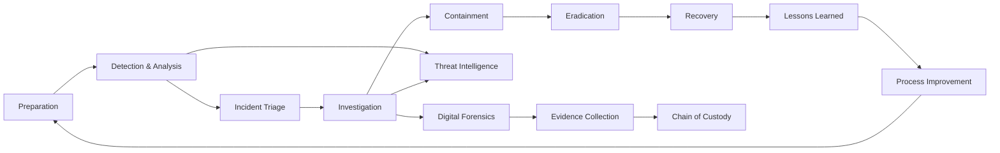

## Executive Summary

Incident Response is a practical and structured discipline focused on identifying, investigating, containing, eradicating, and recovering from cybersecurity incidents. Effective incident response reduces organizational risk, minimizes business impact, preserves evidence, and enables continuous improvement of security operations.

This project provides a comprehensive Incident Response reference designed for security analysts, incident responders, threat hunters, detection engineers, security architects, and cybersecurity professionals seeking a structured approach to managing security incidents.

The repository combines industry-recognized incident response methodologies, operational workflows, investigation techniques, detection strategies, evidence handling practices, threat hunting concepts, and response procedures into a single technical resource. The objective is to provide both foundational knowledge and practical guidance that can be applied across organizations of different sizes, technologies, and security maturity levels.

Topics covered include incident response lifecycle management, threat detection, triage, investigation workflows, containment strategies, eradication techniques, recovery planning, lessons learned, digital forensics concepts, threat hunting methodologies, detection engineering, security operations practices, and modern incident response challenges involving cloud services, identity systems, and emerging technologies.

This repository is intended to serve as a professional reference, educational resource, and operational framework for modern cybersecurity incident response.

## Incident Response Lifecycle Architecture

IncidentResponse/
├── Preparation
├── Detection-and-Analysis
├── Containment
├── Eradication
├── Recovery
├── Lessons-Learned
├── Threat-Hunting
├── Digital-Forensics
├── Detection-Engineering
├── Playbooks
└── References

## Repository Notice

This repository is maintained as a professional cybersecurity reference and educational resource. The content is intended to support incident response, threat hunting, security operations, digital forensics, and detection engineering activities.

The material is provided for educational and professional reference purposes and should be adapted to the requirements of individual organizations and environments.
