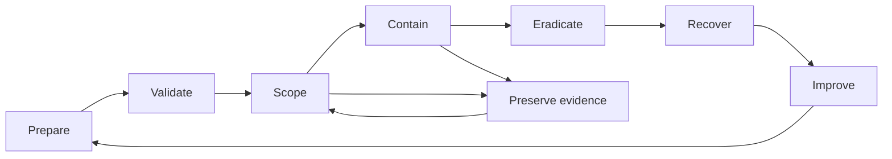

# Incident Detection & Response Framework

This repository is the authoritative source for the standalone Incident Response framework published at [lrinfosec.com/IncidentResponse](https://lrinfosec.com/IncidentResponse/). It provides operational guidance for preparing, validating, scoping, containing, eradicating, recovering from, and learning from security incidents.

The framework is designed for security operations, engineering, infrastructure, identity, cloud, legal, privacy, communications, and business owners. Organizations must adapt authority, telemetry, tooling, regulatory obligations, and safety constraints before using it during a live incident.

## Core capabilities

- Incident command, severity, communications, containment gates, recovery criteria, and exercises
- Detection engineering, telemetry requirements, triage, investigation, and coverage measurement
- Evidence preservation, UTC timelines, chain of custody, confidence, and decision records
- Scenario playbooks for ransomware, data exposure, phishing, identity compromise, insider risk, and malware
- **AI Security Incident Response** for LLMs, agents, prompts, retrieval systems, identities, models, data, and tools
- **Repository and software supply-chain response** for source, workflows, dependencies, packages, credentials, releases, and artifacts
- Reusable responder checklists, worksheets, decision records, and review templates

## Operating model


```mermaid
flowchart LR
    P["Prepare"] --> V["Validate"]
    V --> S["Scope"]
    S --> C["Contain"]
    C --> E["Eradicate"]
    E --> R["Recover"]
    R --> I["Improve"]
    I --> P
    S --> EV["Preserve evidence"]
    C --> EV
    EV --> S
```

The phases are iterative. Every material action should identify the evidence-based trigger, accountable authority, business and safety tradeoffs, rollback path, expected result, and validation method.

## AI Security Incident Response

[`ai-security-ir.html`](ai-security-ir.html) makes AI Security IR a first-class framework capability. It covers:

- Agentic incidents, prompt injection, indirect prompt injection, tool/function abuse, and excessive agency
- RAG and knowledge-source poisoning, sensitive-data disclosure, malicious model/tool behavior, and supply-chain compromise
- Model/API credentials, agent identities, delegated authorization, human approval gates, and unauthorized autonomous actions
- Preservation of prompts, responses, instructions, model/provider versions, configuration, tool calls/results, traces, retrievals, vector-store changes, identities, API/data/network activity, timestamps, correlation IDs, and version history
- Validation, scoping, proportional containment, eradication, staged recovery, rollback, monitoring, and lessons learned
- `AI-IR-01 — AI / LLM Incident`, including first-15-minute and 15–60-minute actions, authority gates, blast-radius analysis, exit criteria, and recovery validation

## Repository and software supply-chain response

[`repository-compromise.html`](repository-compromise.html) covers unauthorized commits, compromised maintainers, workflow modification, dependency and lockfile manipulation, package publishing, CI/CD secrets, PATs, deploy/SSH keys, GitHub Apps, OIDC, cloud/registry/signing credentials, branch protection, tags/releases, automation persistence, and artifact compromise.

The playbook preserves audit and Git evidence before remediation, contains exposed identities and tokens, determines a trusted recovery point, validates workflows and dependencies, runs code/secret/dependency scanning, rebuilds artifacts from trusted source, addresses downstream consumers, and establishes post-recovery monitoring.

## Architecture

```text
IncidentResponse/
├── index.html                         # Framework home and operating model
├── detection.html                     # Detection engineering and triage
├── response.html                      # Incident command and lifecycle procedures
├── playbooks.html                     # Core scenario playbooks
├── ai-security-ir.html                # AI lifecycle and AI-IR-01
├── repository-compromise.html         # Repository/supply-chain playbook
├── resources.html                     # References and responder field kit
├── resources/templates/               # Downloadable operational artifacts
├── css/style.css                      # Local presentation
├── js/main.js                         # Minimal progressive navigation enhancement
└── scripts/site_audit.py              # Dependency-free structural/link audit
```

The site is plain semantic HTML with local CSS and minimal local JavaScript. There is no client framework, analytics, form submission, browser storage, or third-party JavaScript.

## Evidence and chain of custody

Preserve volatile and short-retention evidence first. Record source, collector, UTC timestamps, acquisition method, tool version, SHA-256 where appropriate, storage, access, and transfers. Keep facts, assumptions, confidence, decisions, and evidence gaps distinct. Necessary safety or containment action should not be delayed solely to obtain perfect evidence; record the authority and effect of emergency action.

## Security posture

- Restrictive per-page CSP: local content only, no network connections or form submission
- No third-party JavaScript, analytics, trackers, or runtime dependencies
- External new-tab links require `rel="noopener noreferrer"`
- GitHub Actions use read-only repository contents permission
- Pull requests and pushes to `main` run the repository-native structural and link audit
- Weekly external-link checks identify stale responder references

Security concerns should follow [`SECURITY.md`](SECURITY.md). Do not place credentials, tokens, tenant identifiers, webhook URLs, or sensitive incident data in issues, examples, templates, or commits.

## Deployment and source-of-truth model

GitHub remains the source of truth, split deliberately by responsibility:

- [`leandroer/IncidentResponse`](https://github.com/leandroer/IncidentResponse), `main`: this framework and the GitHub Pages project site at `/IncidentResponse/`
- [`leandroer/leandroer.github.io`](https://github.com/leandroer/leandroer.github.io), `main`: the root LR InfoSec website at `lrinfosec.com`, including articles and top-level navigation

The root website links to this framework; it is not the build source for `/IncidentResponse/`. Framework changes must be made here rather than copied from generated production HTML. Root-site navigation or editorial changes belong in the root-site repository and should be reviewed separately.

The observed deployment evidence and reconciliation decision are recorded in [`docs/deployment-source-of-truth.md`](docs/deployment-source-of-truth.md).

## Validation

Run the dependency-free site audit locally:

```sh
python3 scripts/site_audit.py
```

External links can be checked separately when network access is available:

```sh
python3 scripts/site_audit.py --external
```

## Use and adaptation

This project is a professional reference and educational resource, not organization-specific authorization or legal advice. Test playbooks in exercises and replace generic roles, thresholds, tools, recovery objectives, and escalation paths with approved local procedures.
